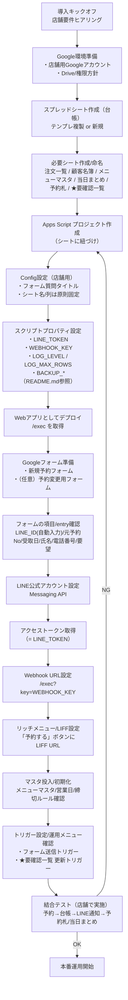

# 弁当テイクアウト予約管理システム（Googleフォーム × スプレッドシート × LINE）

Googleフォームの予約を **スプレッドシート台帳に集約**し、**LINE Bot で通知・予約変更受付**まで行う、店舗向けの予約運用ツールです。  
スプレッドシート側には、**予約札（印刷用）** と **当日まとめ（製造集計）** を自動生成する機能、**★要確認一覧**、**ステータス運用ガード**、**日次バックアップ** を備えています。

---

## できること（主な機能）

### 予約・台帳
- Googleフォーム送信 → 「注文一覧」へ記録（顧客名簿も更新）
- 予約番号運用（No）
- ステータス運用（有効/無効/★要確認）

### 店舗オペレーション
- **予約札を作成（指定日）**：印刷用の札を自動配置
- **当日まとめを更新（指定日）**：メニュー別の製造集計＋注意メモを作成
- **★要確認一覧**：要確認ステータスだけを別シートに抽出して一覧化
- **顧客備考編集（サイドバー）**：顧客の注意事項（調理/事務）を検索・編集

### 管理/安全/保守
- ステータス移行（B案）と運用ガード（入力制限・条件付き書式）
- 理由未記入チェック / ステータス監査
- **Webhook の簡易認証（WEBHOOK_KEY）＋重複排除**
- **日次バックアップ（デフォルト：日次60日＋月次12ヶ月）＋手動スナップショット**

---

## スクリプトプロパティ（Script Properties）
Apps Script の「プロジェクトの設定」→「スクリプト プロパティ」に設定します。  
コード側では `getProperty("KEY")` 直書きを避け、`Config.gs` の `CONFIG.PROPS` 経由で参照する運用を推奨します。

### 必須
- `LINE_TOKEN`：LINEチャネルアクセストークン
- `WEBHOOK_KEY`：Webhook URL の簡易認証キー（`/exec?key=...`）
- `BACKUP_FOLDER_ID`：バックアップ保存先（親フォルダ）の Drive フォルダID

### 推奨（バックアップ運用）
- `BACKUP_DAILY_RETENTION_DAYS`：日次バックアップ保持日数（例：60）
- `BACKUP_MONTHLY_RETENTION_MONTHS`：月次スナップショット保持月数（例：12）
- `BACKUP_USE_MONTHLY_FOLDER`：`1`=日次を `Backups_YYYYMM` 配下へ、`0`=親直下
- `BACKUP_DAILY_FOLDER_KEEP_MONTHS`：古い `Backups_YYYYMM` フォルダ掃除（月）
- `BACKUP_MONTHLY_FOLDER_NAME`：月次スナップショット用フォルダ名（例：MonthlySnapshots）
- `BACKUP_AT_HOUR`：日次バックアップの実行時刻（installDailyBackupTrigger 用、例：3）

### 任意（ログ）
- `LOG_LEVEL`：ログ出力レベル（例：WARN / INFO / DEBUG）
- `LOG_MAX_ROWS`：ログ最大行数（例：2000）


### 設定場所
Apps Script エディタ → **プロジェクトの設定** → **スクリプト プロパティ**

# 店舗運用手順書（チェックリスト）｜弁当予約（Googleフォーム × スプレッドシート × LINE）

## 0) 基本ルール（これだけ覚える）
- ✅ **STATUS 空欄＝有効**（予約札・当日まとめの対象）
- ⛔ **無効 / ★要確認 は理由必須**（漏れは「理由未記入チェック」で潰す）
- 🤔 判断に迷ったら **★要確認** に寄せて「★要確認一覧」で捌く

---

## 1) 初回だけ（導入日 / 設定変更直後）
- [ ] `★予約管理 → ステータス運用ガード適用` を実行（入力ルール＆強調表示）
- [ ] `installNeedsCheckViewTrigger()` を手動実行（★要確認一覧を定期更新：任意）
- [ ] `installDailyBackupTrigger()` を手動実行（自動バックアップ：強く推奨）
- [ ] バックアップ保存先（Driveフォルダ）が正しいか確認

---

## 2) 毎日の運用（おすすめルーチン）

### A. 開店前（目安：開店〜午前中）
- [ ] `★予約管理 → ★要確認一覧を更新`（または開く）
- [ ] ★要確認を上から処理していく（対応メモ/電話確認など）
  - [ ] 対応済 → STATUSを有効（空欄）に戻す / 無効にする（理由必須）
  - [ ] 未対応 → ★要確認のまま、理由に状況を追記

### B. 製造前（目安：製造開始の直前）
- [ ] `★予約管理 → 当日まとめシートを更新`（対象日を入力）
- [ ] `★予約管理 → 指定日の予約札を作成`（対象日を入力）
- [ ] 印刷前チェック（2分）
  - [ ] 当日まとめの合計数が体感とズレてない
  - [ ] 予約札に「無効にしたいもの」が載ってない（載ってたら STATUS確認）

### C. 営業中（例外処理が出たら都度）
**“シート直編集”より「No指定メニュー」を優先（事故が減る）**
- [ ] 変更・キャンセルが来たら：
  - [ ] `★予約管理 → No指定：無効にする（理由必須）`
  - [ ] `★予約管理 → No指定：★要確認にする（理由必須）`
  - [ ] `★予約管理 → No指定：理由だけ編集`
- [ ] 「重複っぽい」「内容が怪しい」「電話番号が無い」などは ★要確認へ

### D. 閉店後（1分で締める）
- [ ] `★予約管理 → 理由未記入チェック`（無効/★要確認の理由漏れをゼロに）
- [ ] `★予約管理 → ステータス監査（値の件数）`（変な値が混ざってないか）
- [ ] （任意）日次バックアップが動いてる前提なら手動は不要

---

## 3) “大きい変更”の前だけ（安心の儀式）
- [ ] `★予約管理 → バックアップ → 手動スナップショット作成`
  - タイミング例：列/シート名を触る前、コード更新前、大量修正前

---

## 4) よくあるトラブル時の切り分け（最短）

### Q1. 予約札/当日まとめに「載るはずがない注文」が混ざる
- [ ] 該当Noの STATUS が空欄になってない？ → 無効 or ★要確認にして理由記入
- [ ] 反映しない場合は「当日まとめ更新」「予約札作成」をもう一度実行

### Q2. ★要確認が増えすぎて回らない
- [ ] ★要確認理由をテンプレ化（例：「TEL確認」「内容不明」「重複疑い」）
- [ ] 午前中に“★要確認だけ捌く時間”を固定で確保（10分でも効果大）

### Q3. 予約Noが見つからない（No指定で弾かれる等）
- [ ] 注文一覧で No を検索（先頭の `'` や空白が混ざることがある）
- [ ] どうしても見つからなければ ★要確認として手動メモ → 後で整合

---

## 5) 役割分担（おすすめ）
- 店長/管理者：初回設定・バックアップ・運用ルール変更
- 現場担当：毎日ルーチン（★要確認→当日まとめ→予約札→閉店チェック）
- 予備：No指定の例外処理（変更/キャンセル対応）

---

## 6) 店舗用メモ（ここだけ埋めて運用を固定）
- 締切時刻（例）：＿＿＿＿（変更受付の運用ルール）
- 当日まとめ作成時刻：＿＿＿＿
- 予約札印刷時刻：＿＿＿＿
- ★要確認の処理担当：＿＿＿＿
- 連絡先（電話確認など）：＿＿＿＿


## 導入フロー



## 全体フロー

```mermaid
flowchart TD
  A[予約者：LINE / フォーム入力] --> B[Googleフォーム送信]
  B --> C[Apps Script onFormSubmit]
  C --> D[注文一覧へ記録]
  C --> E[顧客名簿を更新]
  C --> F[LINEへ通知/返信]
  D --> G[店舗：★予約管理メニューで運用]
  G --> H[予約札作成]
  G --> I[当日まとめ作成]
  G --> J[★要確認一覧]
  G --> K[ステータス運用/理由管理]
  G --> L[バックアップ]
